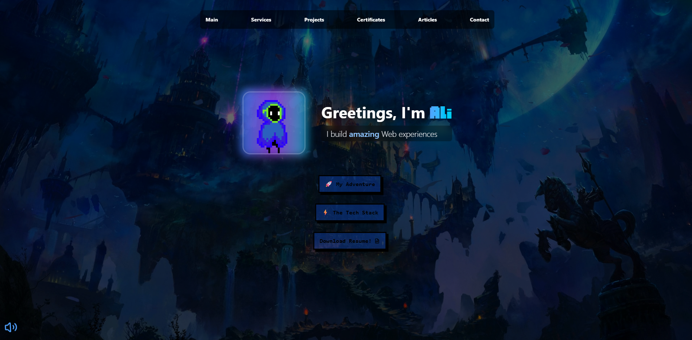

# Ali Al Najjar Portfolio



Welcome to my interactive developer portfolio! This site is a retro-inspired, multimedia-rich showcase of my web development skills, projects, and personality. Dive in to explore my work, tech stack, and more—all wrapped in a playful, animated UI.

---

## 🚀 Features

- **Animated Retro UI**: Pixel/retro popups, animated backgrounds, and custom fonts for a unique vibe.
- **Interactive Navigation**: Responsive navbar, sidebar, and smooth section transitions.
- **Background Music & Sound**: Toggleable music and click sounds for an immersive experience.
- **Project Showcases**: Live previews and GitHub links for featured projects:
  - **AR Warehouse**: E-commerce for esports gadgets ([Live](https://ar-warehouse.vercel.app/) | [Repo](https://github.com/alialridaalnajjar/AR_Warehouse))
  - **Baka Rate**: Anime listing/rating app ([Live](https://alialridaalnajjar.github.io/BakaRate/) | [Repo](https://github.com/alialridaalnajjar/BakaRate))
  - **Pixelated Expo**: Mini-games and restaurant app ([Live](https://studio.code.org/projects/applab/eMJlUxRGQccYPfv5qbbEvPdTIywD6gTC3tcy37LJlOw))
- **About & Tech Stack**: My background, philosophy, and a visual grid of my favorite technologies.
- **Resume Download**: Instantly grab my CV as a PDF.
- **Mobile Friendly**: Fully responsive design with custom layouts for all screen sizes.

---

## 🛠️ Tech Stack

- **Frontend**: React 19, TypeScript, Tailwind CSS
- **UI/UX**: pixel-retroui, custom fonts, framer-motion, lottie-react
- **Icons**: lucide-react, react-icons
- **Routing**: react-router-dom
- **Other**: Vite, ESLint, pnpm

---

## 📦 Getting Started

### Prerequisites

- [Node.js](https://nodejs.org/) (v18+ recommended)
- [pnpm](https://pnpm.io/) (or use npm/yarn, but pnpm is preferred)

### Installation

```bash
pnpm install
```

### Development

```bash
pnpm dev
```

Visit [http://localhost:5173](http://localhost:5173) in your browser.

### Build for Production

```bash
pnpm build
```

### Preview Production Build

```bash
pnpm preview
```

---

## 📁 Project Structure

- `src/`
  - `components/` – Navbar, ProjectSection, ServiceSection, etc.
  - `secondaryComponents/` – Avatar, RetroPopUp, ThreeDButton, etc.
  - `pages/` – MainPage, HomePage, ContentPage, ArticleMenuPage
  - `assets/` – Images, videos, audio, fonts, and PDF resume
  - `types/` – TypeScript type definitions
- `public/` – Static assets (music, icons)
- `index.html` – Main HTML entry
- `tailwind.config.ts`, `vite.config.ts` – Configuration files

---

## ✨ Customization & Notes

- **Sound & Music**: Toggle music in the navbar. Click sounds on interactive elements.
- **Theming**: Uses Tailwind CSS and pixel-retroui for easy style tweaks.
- **Future Ideas**: Contact page, theme switching, more animations, Redux for state, etc.
- **Deployment**: Ready for Vercel (see `vercel.json`).

---

## 👤 Author & Credits

**Ali Al Najjar**  
[LinkedIn](https://www.linkedin.com/in/alialridaalnajjar/)  
[GitHub](https://github.com/alialridaalnajjar)

- Avatar, icons, and some assets are custom or from open sources (see `src/assets/`).
- Inspired by retro/arcade aesthetics and modern web best practices.

---

> _"Fully committed to the philosophy of life-long learning, I'm a full stack developer with a deep passion for TypeScript, React, and all web tech. When I'm not coding, I play games, watch anime, and think about that bug for 12 hours straight."_

Enjoy exploring my portfolio! <3
